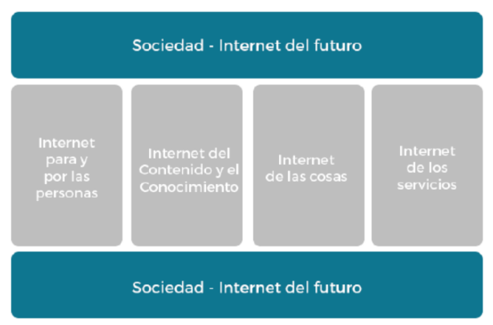

# IOT Fundamentos

## Resumen
La Internet de las cosas es un tema emergente de importancia técnica, social y económica. Y es uno de los pilares de "Internet del Futuro".
Se habla de “Internet del Futuro” como el intento por progresar hacia un marco tecnológico mejor, así como hacia nuevos principios arquitectónicos. Dentro de este nuevo marco se han identificado cuatro pilares principales:

- Internet de las Personas
- Internet de los Contenidos y el Conocimiento
- Internet de los Servicios
- Internet de las Cosas

En este momento se están combinando productos de consumo, bienes duraderos, automóviles y camiones, componentes industriales y de servicios públicos, sensores y otros objetos de uso cotidiano con conectividad a Internet y potentes capacidades de análisis de datos que prometen transformar el modo en que trabajamos, vivimos y jugamos.

Las proyecciones del impacto de la IoT sobre Internet y la economía son impresionantes: hay quienes anticipan que en el año 2025 habrá hasta cien mil millones de dispositivos conectados a la IoT y que su impacto será de US$11.000.000.000.000.

Sin embargo, la Internet de las Cosas también plantea importantes desafíos que podrían dificultar la realización de sus potenciales beneficios. Por esto son importantes los espacios donde se traten las temáticas relacionadas a la seguridad, la privacidad, la interoperabilidad/estandares, cuestiones legales, reglamentarias y de derechos, cuestiones relacionadas con las economías emergentes y el desarrollo.

## Introducción

En esta realidad de conectividad creciente donde surgió la necesidad de definir un nuevo concepto para referirse a la interconexión digital de los objetos de nuestro entorno a través de Internet. Este concepto fue bautizado por primera vez por Kevin Ashton (creador de estándares de tecnologías tan utilizadas como RFID) como “Internet de las Cosas” o “IoT” (Internet of Things) en el año 1999. Esta conceptualización lo convirtió en uno de los promotores de esta tecnología y abanderado en el fomento del uso del Internet de las Cosas en congresos y grandes multinacionales. Dar una definición de IoT no es algo sencillo. Desde un punto de vista tecnológico, The Global Standards Initiative on Internet of Things (IoT-GSI), de ITU, define IoT como:

> “Una infraestructura global en el marco de la sociedad de la información que provee servicios a través de la conexión de elementos físicos o virtuales, basada en tecnologías de la información y la comunicación, tanto existentes como en desarrollo”.

IoT suele dividirse en varias capas de abstracción; la capa física o de percepción, en donde se hace referencia a sensores y actuadores, la capa de red, que consta de los protocolos y tipos de comunicación y la infraestructura de red, la capa de servicios, y, finalmente, la capa de aplicaciones.
IoT es por tanto un paradigma multidisciplinar que abarca desde la tecnología de fabricación de semiconductores o diseño y ensamblado de circuitos tanto micro como nanoelectrónicos, hasta la provisión de servicios web. como así también la definición de estándares, implicancias legales, seguridad entre otros.
Los avances en nuevas interfaces de comunicación, el uso de procesamientos de datos mas eficientes, la inteligencia artificial, permiten desplegar escenarios mas complejos e innovadores. Donde el uso de objetos inteligentes permite captura y controlar de forma autónoma multitud de procesos, lo que unido a una comunicación continua permite la ejecución de actividades coordinadas. Hoy en día es posible realizar tareas complejas como el control industrial, la gestión de una red eléctrica descentralizada, el control de fabricación, etc.

## Desafios de IoT
- **SEGURIDAD:** Por principio, los desarrolladores y usuarios de dispositivos y sistemas de la IoT tienen la obligación colectiva de asegurar que no estén exponiendo a los usuarios y la propia Internet a daños potenciales. Por lo tanto, se necesitará un enfoque colaborativo para desarrollar soluciones eficaces y adecuadas ante los desafíos de seguridad de la IoT, soluciones que se adapten bien a la escala y complejidad de los problemas. 
- **PRIVACIDAD:** Para aprovechar las oportunidades, se deberán desarrollar estrategias para respetar las opciones de privacidad individuales considerando un amplio espectro de expectativas, sin dejar de fomentar la innovación en nuevas tecnologías y servicios.
- **INTEROPERABILIDAD / ESTÁNDARES:** Contar con estándares apropiados, modelos de referencia y mejores prácticas también ayudará a frenar la proliferación de dispositivos que podrían alterar a Internet. El uso de estándares genéricos, abiertos y ampliamente disponibles (como el Protocolo de Internet) como componentes de los dispositivos y servicios de la IoT permitirá mayores ventajas para los usuarios, más innovación y más oportunidades económicas.
- **LEGALES, REGLAMENTARIAS Y DE DERECHOS:** El uso de dispositivos de la IoT amplifica los problemas legales que ya existen en torno a Internet. Muchas veces el ritmo con que cambia la tecnología de la IoT supera la capacidad de adaptación de las estructuras políticas, legales y reglamentarias asociadas. resultados discriminatorios para ciertos usuarios. Otros problemas legales relacionados con los dispositivos de la IoT incluyen el conflicto entre la vigilancia por parte de las agencias de seguridad y los derechos civiles, las políticas de retención y destrucción de datos, y la responsabilidad legal por los usos accidentales, las violaciones de la seguridad y los fallos en la privacidad. Los flujos de datos transfronterizos, que se producen cuando los dispositivos de la IoT recogen datos personales en una jurisdicción y, para su procesamiento, los transmiten a otra jurisdicción donde las leyes de protección de datos son diferentes. Además, los datos recogidos por los
dispositivos de la IoT podrían ser mal utilizados. Por esto es fundamental la evolución de las licencias, leyes y reglamentos sobre la IoT que propicien los derechos de los usuarios. 
- **ECONOMÍAS EMERGENTES Y EL DESARROLLO:** se deberán abordar las singulares necesidades y desafíos de la implementación en las regiones
menos desarrolladas, entre ellos el grado de preparación de la infraestructura, los incentivos para el mercado y la inversión, los requerimientos en cuanto a las habilidades técnicas y los recursos políticos. 

Las relaciones entre los objetos, su entorno y las personas están cada vez más entrelazadas. Sin embargo, para que la IoT realice sus potenciales beneficios para las personas, la sociedad y la economía, es necesario considerar y abordar los problemas y desafíos asociados con la IoT.

## Principales aplicaciones 
- **Industria 4.0:** La maquinaria que se encarga de controlar los procesos de fabricación, robots ensambladores, sensores de temperatura, control de producción, etc. Todo está conectado a Internet en cada vez más empresas, lo que permite crear sistemas ciberfísicos donde lo físico y lo digital interactúan en tiempo real. Inmersas en esta cuarta revolución industrial, las tecnologías IoT están cada vez más presentes, lo que se está empezando a conocer como IIoT (Industrial Internet of Things).
- **Ciudades inteligentes:** Actualmente, el 50% de la población vive en las ciudades, llegando al 75% en Europa, por lo que se hacen necesarias soluciones que ayuden en la gestión de la vida diaría de la ciudad de una manera inteligente y sostenible: control de semáforos, puentes, aparcamientos, vías de tren, iluminación, cámaras urbanas, etc. Cada vez más ciudades implementan este tipo de infraestructuras basadas en IoT que permiten monitorizar el correcto funcionamiento de sus estructuras además de adaptar más flexiblemente su funcionamiento ante nuevos eventos. 
- **Control ambiental:** Una de las áreas en las que está teniendo más éxito IoT es el control ambiental, pues permite acceder desde prácticamente cualquier parte a información de sensores atmosféricos, meteorológicos y sísmicos.
- **Sector salud (eHealth):** Cada vez más clínicas y hospitales alrededor del mundo confían en sistemas que permiten al personal de salud monitorear activamente a los pacientes de manera ambulatoria y no invasiva.
- **Inteligencia Artificial:** El uso de la inteligencia artificial (IA) en medicina y salud está ganando impulso: el diagnóstico médico resulta más fácil a través de herramientas que permiten el reconocimiento de imagen y la visualización de los cambios en la apariencia del paciente. La IA también permitirá explorar de forma segura las interacciones químicas y biológicas de diferentes fármacos que se encuentren en desarrollo. Otra ventaja es la optimización del flujo de trabajo, permitiendo automatizar tareas repetitivas que debe hacer el médico y que acostumbra a llevar horas de trabajo.
- **Realidad Virtual y aumentada:** El paciente podrá emerger en un entorno creado de manera totalmente artificial a través de unas gafas VR/AR, un recurso utilizado para diagnosticar enfermedades o, en algunos casos, durante procesos de rehabilitación. También, los cirujanos podrán recurrir a la realidad virtual para visualizar reconstrucciones de órganos en 3D y ensayar procedimientos que les permitirán realizar operaciones más rápidamente en situaciones reales y con un daño mínimo en los tejidos.
- **La red eléctrica (smart grid):**  Utiliza computadoras y las redes de comunicación para dar un mejor seguimiento y control de la red eléctrica.
- Big Data y análisis: Las nuevas soluciones integradas podrán recopilar, interconectar, almacenar y analizar datos para que los profesional realicen un diagnóstico más preciso y rápido.
- **Agricultura/ganadería:** Con sistemas de optimización de riego, que incluyen sensores para detectar la humedad del suelo, la temperatura ambiente y el pronóstico del tiempo. En cuanto a la ganadería, el uso de la identificación por radiofrecuencia (RFID) del ganado, lo que facilita el conteo y, en algunos casos, la ubicación de los animales.
- **Seguimiento de activos e inventario:** Los propietarios de valiosas piezas de equipo, tales como excavadoras, cargadores frontales, motoniveladoras y tractores, pueden estar al tanto de su ubicación y su condición.

## Conclusiones
Internet de las cosas promete abrir la puerta a un mundo revolucionario, más “inteligente”, totalmente interconectado, en el cual las relaciones entre los objetos, las personas y su entorno se entrelazan cada vez más. Esta omnipresencia de dispositivos conectados está dando lugar una nueva era para todo el mundo, transformando modelos económicos, procesos productivos, industrias y revolucionando aspectos de la vida diaria de cada individuo. Pero existen una serie de temáticas, que deben ser consideradas por los distintos actores involucrados, principalmente las mencionadas a lo largo del documento, seguridad, privacidad, interoperabilidad y estándares y las economías emergentes.
Por lo tanto Internet de las cosas implica un complejo conjunto de consideraciones tecnológicas, sociales y políticas en constante evolución.
Para definir las formas más eficaces de avanzar, se necesitará la participación informada, el diálogo y la colaboración de una variedad de partes interesadas.

## Referencias
- Diplomatura IOT - UTN - https://www.internetsociety.org/wp-content/uploads/2017/09/report-InternetOfThings-20160817-es-1.pdf
- https://www.argentina.gob.ar/sites/default/files/paperbenchmarkinternacional-iot.pdf
- http://ecixgroup.com/el-grupo/una-aproximacion-algunos-elementos-de-internet-de-las-
cosas/
- https://pdfs.semanticscholar.org/e4ce/63ff3e0120f63258e19c48b65feb4b3dd0a6.pdf
- Foundations of moderm networking, William Stallings
- https://jelvix.com/blog/iot-architecture-layers

