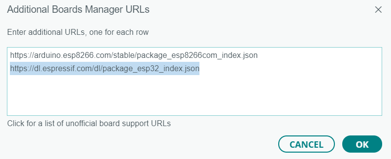
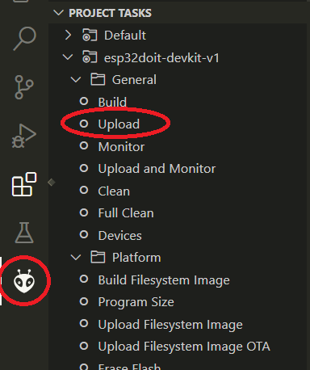

# Sensor de Humedad y Temperatura DHT12 - Microcontrolador ESP32

El codigo para sensar humedad y temperatura a traves del sensor DHT12 puede ser cargado al micrcontrolador ESP32 a traves de cualquiera de las siguientes interfaces: ArduinoIDE o PlatformIO.

---

## Requisitos previos
*(Los siguientes requisitos son necesarios, independientemente de la IDE escogida)*
- Instalar el driver CH340 necesario para utilizar el ESP32 
- (Opcional) Instalar algun software de terminal serial para monitorear las respuestas del microcontrolador a la PC

#### ArduinoIDE:

- Instalar la IDE de Arduino ([Pagina Oficial](https://www.arduino.cc/en/software))

#### PlatformIO IDE:

- Instalar Visual Studio Code ([Pagina Oficial](https://code.visualstudio.com/))
- Dentro del Visual Studio Code, seleccionar en el panel izquierdo **Extensiones** y luego instalar **PlatformIO IDE** de PlatformIO

---

## Configuracion de Librerias

#### ArduinoIDE:

Dentro de ArduinoIDE, seleccionar la opcion **Library Manager** en el panel izquierdo. Instalar las siguientes librerias:

- **PubSubClient** por Nick O'Leary
- **DHT12** por Renzo Mischianti
- **ArduinoJSON** por Benoit Blanchon

Adicionalmente, se deben instalar las configuraciones de placas ESP32 dentro del IDE. Para ello, ir a:

> File > Preferences > Aditional boards manager URLs

y colocar el siguiente enlance:

`https://dl.espressif.com/dl/package_esp32_index.json`

#### PlatformIO IDE:

Ingresar al menu principal de PlatformIO a traves del icono en el menu lateral izquierdo. Crear un nuevo proyecto. Tras escoger el nombre del proyecto, seleccionar en la opcion **Board** la placa **DOIT ESP32 DEVKIT V1**. Dejar las demas opciones por defecto. Una vez creado el proyecto, dentro del menu principal, ir al menu **Libraries** y agregar al proyecto las siguientes librerias:

- **PubSubClient** por Nick O'Leary
- **DHT12** por Renzo Mischianti
- **ArduinoJSON** por Benoit Blanchon

Se puede verificar que las librerias se instalaron correctamente, revisando el archivo **platformio.ini** dentro del proyecto en la seccion "libraries".

---

## Implementacion y ejecucion

Dentro del codigo, modificar las constantes `ssid`, `password`, `mqtt_broker`, `topic`, `mqtt_username`, `mqtt_password` y `mqtt_port` con los valores correspondientes. 

#### ArduinoIDE:

Copiar y pegar el codigo dentro de un sketch nuevo. Tras agregar el codigo al archivo con extension `.ino`, seleccionar en el menu superior las siguientes opciones:

> Tools > Board > ESP32 > ESP32 DEV Module

> Tools > Port > "PuertoCorrespondiente" (tty en Linux / COM# en Windows)

Si las configuraciones son correctas, en la esquina inferior derecha se deberia indicar que se esta conectado a la placa ESP32 DEV KIT en el puerto correspondiente.
Por ultimo, para cargar el codigo al ESP32, utilizar el boton "Upload" (Simbolo &rarr;). Tras cargar el codigo, se puede utilizar un monitor serial externo, o configurar el monitor serial de arduino utilizando el boton de la esquina superior derecha, y la opcion **OPEN SERIAL MONITOR**. 
*(En ambos casos, se debe configurar el Baud-rate adecuado para poder leer la informacion)*

#### PlatformIO IDE:

Modificar el archivo `main.cpp` y agregar el codigo correspondiente. Este archivo se encuentra ubicado en la carpeta **src** dentro del proyecto. Por ultimo, compilar y cargar el codigo. Para ello, al clickear el icono de PlatformIO dentro del panel izquierdo de Visual Studio Code, ir a la siguiente opcione dentro del panel de PlatformIO.

> PROJECT TASK > esp32doit-devkit-v1 > General > Upload

Una vez finalizada la carga, se puede monitorear la respuesta de la placa utilizando un monitor serial, ya sea instalando un software externo, o utilizando alguna extension adicional dentro de Visual Studio Code.
