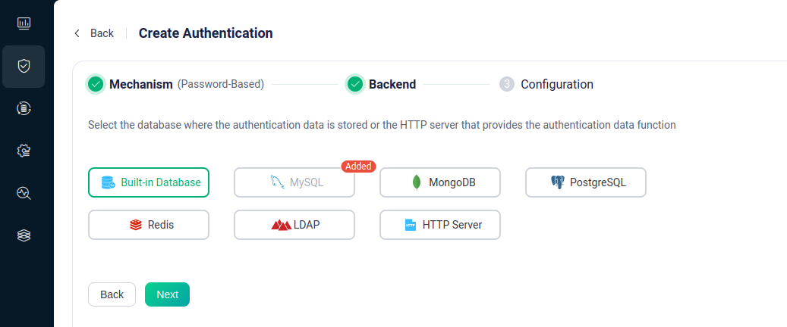
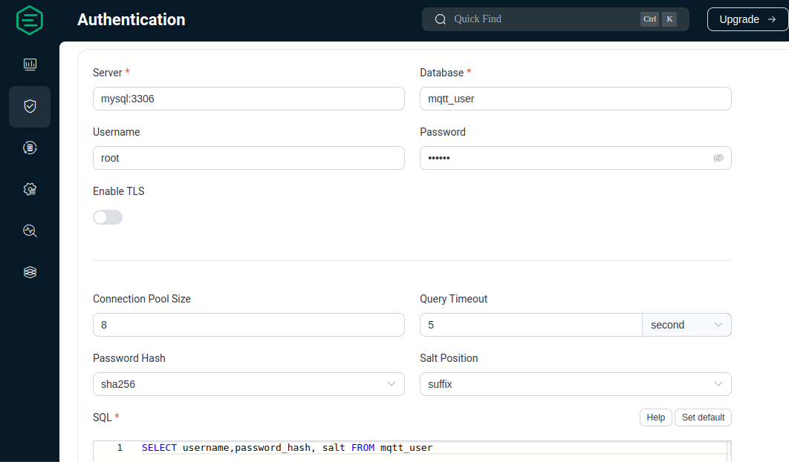
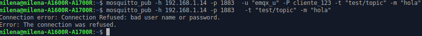
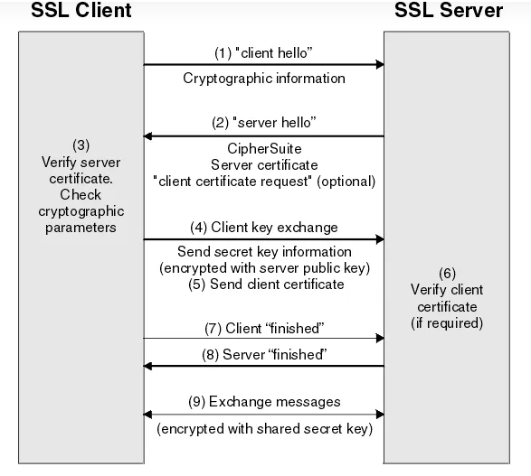
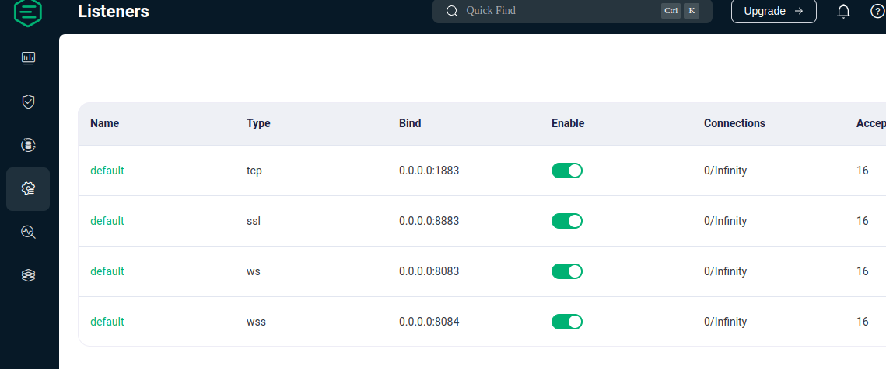
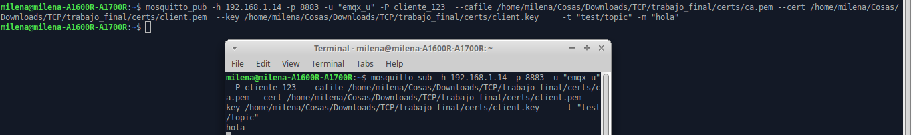
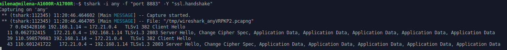

# Seguridad EMQX

# Autenticación 

### Introducción
Este proceso se emplea para verificar la identidad del cliente MQTT y prevenir que terceros puedan publicar o suscribirse sin autorización.
Para almacenar los datos necesarios para autenticar clientes MQTT, se utiliza una base de datos MySQL a la cual el servidor EMQX consulta para verificar la coincidencia entre el usuario y contraseña que el cliente utiliza para publicar o suscribirse y las que están almacenadas.

### MySQL
Es una base de datos, se utiliza para estructurar y organizar los datos. Estos datos se almacenan en una estructura de "matriz" donde las columnas, conocidas como atributos, representan el tipo de dato almacenado, y las filas, llamadas registros, contienen los datos organizados en cada columna correspondiente dentro de una matriz de datos.

### Tipo de Autenticación: basada en contraseña

En esta sección, se implemento la autenticación para clientes MQTT utilizando nombre de usuario y contraseña, como se menciono anteriormente. Las contraseñas se almacenan de manera "hasheada". Esto significa que la contraseña se combina con el algoritmo SHA256 y se guarda en la base de datos como una cadena de caracteres, donde la contraseña original no es reconocible. Debido a que este proceso es unidireccional, no es matemáticamente posible recuperar la contraseña original a partir de los datos almacenados en la base de datos, incluso conociendo el algoritmo y el salt.

## Configuración de Autenticación con MySQL

### Paso 1: Archivo init.sql para Configurar la Base de Datos

Esta configuración se explica en caso de que se desee agregar nuevas tablas o registros, aunque ya se tenga el archivo.
 Creo archivo:
```bash
    touch init.sql
 ```
entro a editarlo:
```bash
    nano init.sql
 ```
dentro de el pongo tabla con atributos de interes:
```bash
    CREATE TABLE `mqtt_user` (
  `id` int(11) unsigned NOT NULL AUTO_INCREMENT,
  `username` varchar(100) DEFAULT NULL,
  `password_hash` varchar(100) DEFAULT NULL,
  `salt` varchar(35) DEFAULT NULL,
  `is_superuser` tinyint(1) DEFAULT 0,
  `created` datetime DEFAULT NULL,
  PRIMARY KEY (`id`),
  UNIQUE KEY `mqtt_username` (`username`)
) ENGINE=InnoDB DEFAULT CHARSET=utf8mb4;
 ```
Ahora agrego la informacion que voy almacenar en cada atributo, agrego un registro por cliente:
```bash
  INSERT INTO mqtt_user(username, password_hash, salt, is_superuser) VALUES ('emqx_u', SHA2(concat('public', 'slat_foo123'), 256), 'slat_foo123', 1);
Query OK, 1 row affected (0,01 sec)
 ```
### Paso 2: orden de almacenamiento 

1. Creo un directorio para el proyecto:

    ```bash
    mkdir mi_proyecto
    cd mi_proyecto
    ```

2. Guardo los siguientes archivos en el directorio creado:
   - `docker-compose.yaml`
   - `init.sql`
3. Creo directorio data y le doy permisos
   ```bash
    mkdir data
    chmod 777 data
    ```

### Paso 3: Configuración de Docker

1. Creo una red Docker llamada `mi_red`:

    ```bash
    docker network create mi_red
    ```
3. Levanto los contenedores utilizando `docker-compose`:

    ```bash
    docker-compose up -d
    ```
### Paso 4: Configuración del Dashboard EMQX  

Accede al dashboard de EMQX desde [http://0.0.0.0:18083](http://0.0.0.0:18083).

1. Selecciono la opción de autenticación y aprieto "create" y 
   
    

2.  luego "MySql"
     
    
3.  Presiono settings y configuro de la siguiente forma:

 

## Pruebas con Mosquitto: Verificación de Funcionamiento

previo instalamos el mosquito y desactivamos el servidor, ya que usa el mismo puerto que usamos para las pruebas.
verificamos que nadie usa ese puerto con:

```bash
    sudo lsof -i :3306
```

 

 estructura del pub y sub:
 ```bash
   mosquitto_pub -h localhost  -p 1883  -u "usuario" -P contra -t "algun/topico" -m "agun_mensaje"
  ```
```bash
   mosquitto_pub -h localhost  -p 1883  -u "usuario" -P contra -t "algun/topico" -m "agun_mensaje"
  ```

(se hace pub y sub desde consolas diferentes)

# Autenticacion por Certificados  X.509

## Introduccion
El protocolo usado a continuacion es SSL/TLS "socket segure layer" y "transport segure Layer" ya que este protocolo permitio a las partes verificar la identidad del otro mediante certificados digitales X.509 emitidos por instituciones de confianza. 
Este protocolo consta dos partes:
Handshake y record que se van a describir a continuacion. En nuestro caso usamos certificacion de "dos vias" por lo tanto se crearon certificados tanto para los clientes MQTT como para el servidor EMQX.

## Certificados Autofirmados
Como se menciono anteriormente, los certificados deben crearse  por "instituciones de confianza" en este caso, esta "institucion" se invento por medio de la creacion de un certificado autofirmado ca.pem que luego se utilizo para "firmar" los certificados tanto del servidor como del cliente. El proceso de creacion se detalla en la seccion de configuracion

## certificacion en "dos vias"
Este fue el tipo de certificacion elegida, la cual implica el intercambio entre y cliente y servidor de sus propios certificados. Obviamente deben ser calificados como "validos" para lo cual, como se menciono anteriomente, ambos se firmaron con la "institucion ficticia" creada en el ca.pem esto se detalla en la configuracion.
Como mencionamos en la introduccion el protocolo SSL/TLS consta de dos partes:

### Hanshake
El "handshake" (apretón de manos)  se refiere al proceso mediante la cual el cliente y servidor establecen una conexión segura y autenticada antes de intercambiar datos.Seria una especie de "dialogo" entre ambos.

#### 1.
El mensaje de "hola" del cliente": el cliente inicia el protocolo de enlace enviando un mensaje "hola" al servidor. El mensaje incluirá: versión de TLS que admite el cliente, los conjuntos de cifrado compatibles y una cadena de bytes aleatorios "cliente aletorio"
#### 2.
El mensaje de "hola" del servidor": en respuesta al mensaje de hola del cliente, el servidor envía un mensaje que contiene el certificado del servidor (emqx.pem), el conjunto de cifrado elegido por este, y otra cadena aleatoria de bytes que genera el servidor "servidor aleatorio"
#### 3.
Solicitud de Certificado del Cliente:El servidor solicita al cliente que proporcione su certificado para autenticación.
#### 4.
El cliente envía su certificado al servidor, demostrando su identidad.
(client.pem)
#### 5.
El cliente "verifica" el certificado del servidor (emqx.pem)  
#### 6.
El servidor "verifica" el certificado del cliente (cliente.pem) 
#### 7.
Secreto Premaster:El cliente utiliza su clave privada (cliente.key) para firmar digitalmente el secreto premaster antes de enviarlo.
Uso: Asegura la autenticidad del cliente, garantizando que el mensaje viene efectivamente del cliente que posee el certificado.

#### 8.
Envió del Secreto Premaster:
El cliente envía el secreto premaster cifrado al servidor.
Uso: Asegura que solo el servidor puede descifrarlo utilizando su clave privada (emqx.key).
#### 9.
Descifrado del Secreto Premaster:
El servidor descifra el secreto premaster con su clave privada (emqx.key).
#### 10.
Generación de Claves de Sesión:
Tanto el cliente como el servidor generan claves de sesión a partir del cliente aleatorio, el servidor aleatorio y el secreto premaster.
Ambas partes deberían llegar a las mismas claves de sesión.
#### 11.
El cliente envía un mensaje "Terminado" cifrado con una clave de sesión, indicando que está listo.
#### 12.
El servidor envía un mensaje "Terminado" cifrado con una clave de sesión, indicando que también está listo.
Encriptación Simétrica:
La comunicación continúa utilizando las claves de sesión para asegurar la confidencialidad e integridad de los datos.



### Record

Una vez que el handshake ha sido completado exitosamente y se ha establecido una conexión segura TLS/SSL, es cuando entra en juego el concepto de "record":
El "record" es muy similar a otros protocolos de transmisión de datos. Transporta tipo de contenido, versión, longitud, carga, etc., y la diferencia es que la información transportada por este protocolo está encriptada.

## Pasos de la configuracion 


### creacion de certificados

En primer lugar creo en mi_proyecto un directorio llamado certs y  me posisiono dentro de esa carpeta.

```bash
    mkdir certs
```
le doy a esa carpeta todos los permisos:
```bash
    chmod 777 certs
```
instalo open SSL

```bash
    sudo apt install openssl
```

#### Certificado autofirmado
Genero el certificado ca.pem autofirmado:

primero genero clave privada para firmarlo:
```bash
    openssl genrsa -out ca.key 2048
```
luego lo creo 
```bash
   openssl req -x509 -new -nodes -key ca.key -sha256 -days 3650 -out ca.pem   
```

#### Certificados para el servidor

en principio clave privada:
```bash
    openssl genrsa -out emqx.key 2048
```
luego creo archivo openssl.cnf 
```bash
    touch openssl.cnf 
```
```bash
    nano openssl.cnf 
```
lo edito con el siguiente archivo cambio SOLO donde dice broker_address, alli pongo la direccion ip de mi servidor emqx:
```bash
    [req]
default_bits  = 2048
distinguished_name = req_distinguished_name
req_extensions = req_ext
x509_extensions = v3_req
prompt = no
[req_distinguished_name]
countryName = CN
stateOrProvinceName = Zhejiang
localityName = Hangzhou
organizationName = EMQX
commonName = CA
[req_ext]
subjectAltName = @alt_names
[v3_req]
subjectAltName = @alt_names
[alt_names]
IP.1 = BROKER_ADDRESS
DNS.1 = BROKER_ADDRESS

```
luego uso esa clave y configuracion para solicitar un certificado 

```bash
   openssl req -new -key ./emqx.key -config openssl.cnf -out emqx.csr

```
por ultimo uso el ca.pem para generar el certificado de emqx:

```bash
    openssl x509 -req -in ./emqx.csr -CA ca.pem -CAkey ca.key -CAcreateserial -out emqx.pem -days 3650 -sha256 -extensions v3_req -extfile openssl.cnf

```
#### Certificados del cliente
clave del cliente:
```bash
   openssl genrsa -out client.key 2048

```
archivo de solicitud de cliente: 
```bash
   openssl req -new -key client.key -out client.csr -subj "/C=CN/ST=Zhejiang/L=Hangzhou/O=EMQX/CN=client"

```

firmo y genero certificado de cliente: 
```bash
   openssl x509 -req -days 3650 -in client.csr -CA ca.pem -CAkey ca.key -CAcreateserial -out client.pem

```
#### configuracion del dashboard
Dentro de "Listeners" en la columna izquierda, selecciona el listener por default para SSL.



Cargo los archivos de encriptación en el siguiente orden: `emqx.pem`, `emqx.key`, `ca.pem`, luego presiona "Update".


 y pongo Force Verify Peer Certificate en true y habilito verify Peer

 importante en advance settings pongo la version 1.2 de TLS en el listener


## Pruebas



