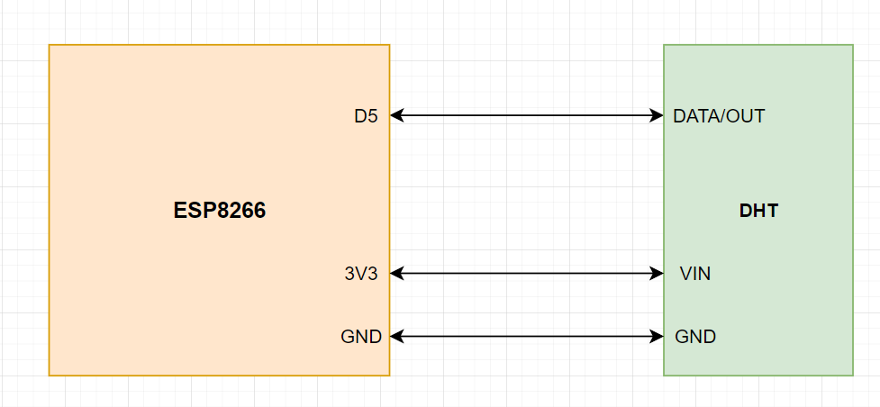
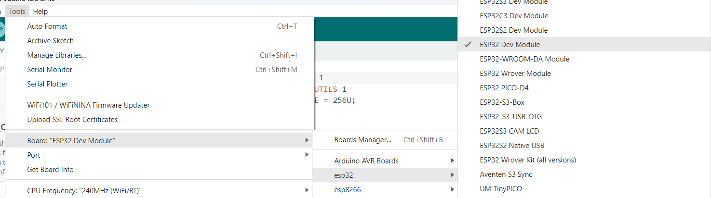
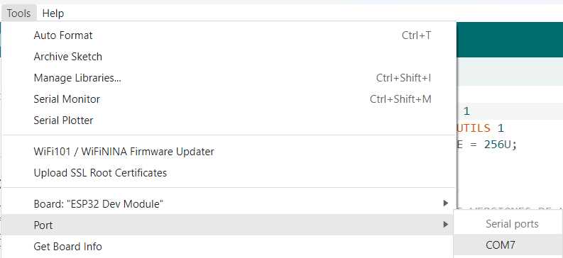

# 
 WEMOS LOLIN D1 mini - Sensor de Humedad, temperatura y presion DHT12

  

## Introduccion

En esta seccion se detalla brevemente como realizar mediciones de humedad, temperatura y presion del ambiente utilizando el sensor DHT12 (WEMOS Shield) en conjunto con el microcontrolador WEMOS LOLIN D1 mini y posteriormente enviar los datos obtenidos a un servidor MQTT.  

## Que es el microcontrolador LOLIN D1 mini?

El dispositivo LOLIN D1 mini es un microcontrolador compacto que cuenta con una placa WiFi con 4MB de memoria flash y esta basado en la arquitectura ESP-8266EX. Ademas cuenta con 11 pines entrada/salida digitales, 1 pin de entrada analogica (maximo de tension de 3.2V), puerto de USB tipo USB-C, puerto de I2C y compatibilidad con MicroPython o Arduino.
[(Documentacion oficial LOLIN D1 mini)](https://docs.wemos.cc/en/latest/d1/d1_mini.html) 

## El sensor DHT11/DHT12

Los sensores DHT estan compuestos de dos partes, un sensor de humedad capacitivo y un termistor. Tambien incluyen un chip con una logica interna que permite realizar la conversion de datos analogicos a digitales lo que devuelve señales digitales de temperatura y humedad, que pueden ser leidas facilmente por cualquier microcontrolador. Particularmente, el sensor DHT11 cuenta con una entrada de tension de alimentacion de 3V a 5V, y un pin de salida digital. Este sensor realiza mediciones de humedad de entre el 20-80% con error de precision del 5%, y mediciones de temperatura de 0-50°C con error de precision de ±2°C. Ademas cuenta con una tasa de muestreo de 1 Hz, lo que permite realizar un maximo de una medicion por segundo. 
[(Documentacion oficial DHT - Adafruit)](https://learn.adafruit.com/dht/overview) 

## Firmware en el ESP8266: Tasmota

Para poder utilizar el conjunto LOLIN D1 mini - DHT11, una de las opiones posibles es utilizar MycroPython o Arduino, y programar con las librerias correspondientes un codigo que permita obtener mediciones de temperatura y humedad cada cierto periodo. Adicionalmente, se deben agregar librerias y funciones que permitan enviar los datos anteriormente recolectados a un servidor MQTT con su correspondiente tema o "topic" y sus datos de conexion.
Para este proyecto, se escogio otro enfoque distinto, y se decidio modificar el firmware original del ESP8266 por Tasmota, lo que resuelve el problema de leer los datos y enviarlos utilizando el protocolo MQTT a un servidor. [(Instalacion de Tasmota)](./sonoff.md)

*(Nota: Al instalar Tasmota para el LOLIN D1 mini, si se desea utilizarlo en conjunto con el sensor DHT, escoger la opcion **DHT** dentro del paso **Configuration Module** y escoger como pin de lectura el pin D4 si se utiliza el WEMOS DHT12 Shield, o el pin correspondiente si se utiliza un sensor DHT11/DHT12 generico)*

---

## Anexo - Conexion Microcontrolador ESP8266/ESP32 Generico y sensor DHT11 Generico

A continuacion se proporcionara los pasos necesarios para poder conectar el sensor DHT11 a una placa que cuente con un ESP8266 o un ESP32 sin la utilizacion de Tasmota. Las instrucciones estan definidas para un ESP32, pero son similares para el ESP8266. El esquema de conexiones es el siguiente: 

*(Nota: El diagramas de conexiones es el mismo para el ESP8266 y para el ESP32)*

El codigo para sensar humedad y temperatura a traves del sensor DHT11 puede ser cargado al micrcontrolador ESP32 a traves de cualquiera de las siguientes interfaces: ArduinoIDE o PlatformIO.

## Requisitos previos
*(Los siguientes requisitos son necesarios, independientemente de la IDE escogida)*
- Instalar el driver CH340 necesario para utilizar el ESP32 *(driver CP210x para ESP8266)* 
- (Opcional) Instalar algun software de terminal serial para monitorear las respuestas del microcontrolador a la PC

#### ArduinoIDE:

- Instalar la IDE de Arduino ([Pagina Oficial](https://www.arduino.cc/en/software))

#### PlatformIO IDE:

- Instalar Visual Studio Code ([Pagina Oficial](https://code.visualstudio.com/))
- Dentro del Visual Studio Code, seleccionar en el panel izquierdo **Extensiones** y luego instalar **PlatformIO IDE** de PlatformIO

---

## Configuracion de Librerias

#### ArduinoIDE:

Dentro de ArduinoIDE, seleccionar la opcion **Library Manager** en el panel izquierdo. Instalar las siguientes librerias:

- **PubSubClient** por Nick O'Leary
- **DHT12** por Renzo Mischianti
- **ArduinoJSON** por Benoit Blanchon

Adicionalmente, se deben instalar las configuraciones de placas ESP32 dentro del IDE. Para ello, ir a:

> File > Preferences > Aditional boards manager URLs

y colocar el siguiente enlance:

`https://dl.espressif.com/dl/package_esp32_index.json`

si se utiliza un ESP8266, colocar el siguiente enlace:

`http://arduino.esp8266.com/stable/package_esp8266com_index.json`

#### PlatformIO IDE:

Ingresar al menu principal de PlatformIO a traves del icono en el menu lateral izquierdo. Crear un nuevo proyecto. Tras escoger el nombre del proyecto, seleccionar en la opcion **Board** la placa **DOIT ESP32 DEVKIT V1**. Alternativamente, si se utiliza un ESP8266, escoger **esp8266** y luego elegir la placa correspondiente. Dejar las demas opciones por defecto. Una vez creado el proyecto, dentro del menu principal, ir al menu **Libraries** y agregar al proyecto las siguientes librerias:

- **PubSubClient** por Nick O'Leary
- **DHT12** por Renzo Mischianti
- **ArduinoJSON** por Benoit Blanchon

Se puede verificar que las librerias se instalaron correctamente, revisando el archivo **platformio.ini** dentro del proyecto en la seccion "libraries".

---

## Implementacion y ejecucion

Dentro del codigo, modificar las constantes `ssid`, `password`, `mqtt_broker`, `topic`, `mqtt_username`, `mqtt_password` y `mqtt_port` con los valores correspondientes. 

#### ArduinoIDE:

Copiar y pegar el codigo dentro de un sketch nuevo. Tras agregar el codigo al archivo con extension `.ino`, seleccionar en el menu superior las siguientes opciones:

> Tools > Board > ESP32 > ESP32 DEV Module

*(Reemplazar ESP32 por ESP8266 y escoger la placa correspondiente, en caso de ser necesario)*

> Tools > Port > "PuertoCorrespondiente" (tty en Linux / COM# en Windows)

Si las configuraciones son correctas, en la esquina inferior derecha se deberia indicar que se esta conectado a la placa ESP32 DEV KIT en el puerto correspondiente.
Por ultimo, para cargar el codigo al ESP32, utilizar el boton "Upload" (Simbolo &rarr;). Tras cargar el codigo, se puede utilizar un monitor serial externo, o configurar el monitor serial de arduino utilizando el boton de la esquina superior derecha, y la opcion **OPEN SERIAL MONITOR**. 
*(En ambos casos, se debe configurar el Baud-rate adecuado para poder leer la informacion)*

#### PlatformIO IDE:

Modificar el archivo `main.cpp` y agregar el codigo correspondiente. Este archivo se encuentra ubicado en la carpeta **src** dentro del proyecto. Por ultimo, compilar y cargar el codigo. Para ello, al clickear el icono de PlatformIO dentro del panel izquierdo de Visual Studio Code, ir a la siguiente opcione dentro del panel de PlatformIO.

> PROJECT TASK > esp32doit-devkit-v1 > General > Upload

*(En caso de utilizar un ESP8266, el nombre del proyecto sera diferente)*

Una vez finalizada la carga, se puede monitorear la respuesta de la placa utilizando un monitor serial, ya sea instalando un software externo, o utilizando alguna extension adicional dentro de Visual Studio Code.
