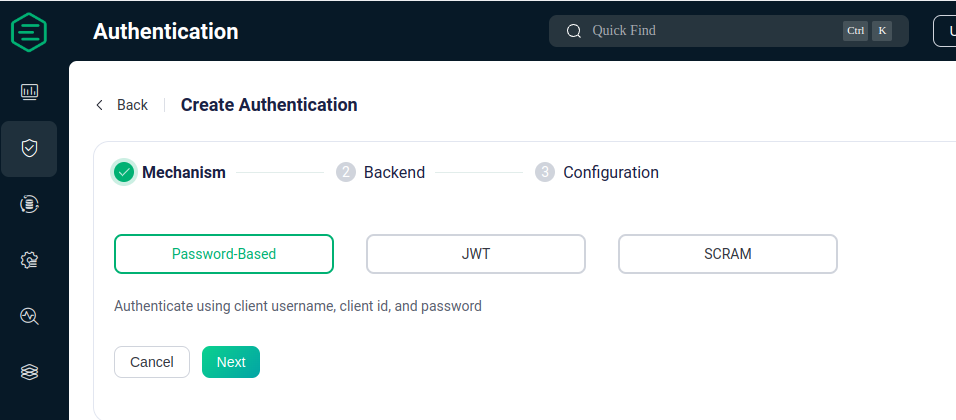
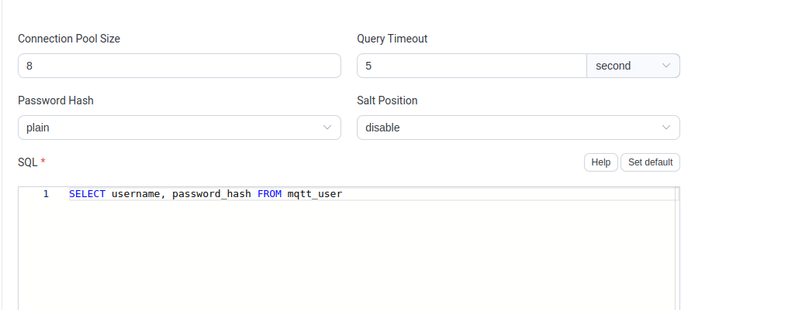

# Seguridad EMQX

## Autenticación con MySQL

Este documento describe los pasos necesarios para configurar la seguridad en EMQX utilizando MySQL para la autenticación y Portainer para la administración de contenedores Docker.

### Paso 1: Preparación de archivos y directorios

1. Crea un directorio para el proyecto:

    ```bash
    mkdir mi_proyecto
    cd mi_proyecto
    ```

2. Guarda los siguientes archivos en el directorio creado:
   - `docker-compose.yaml`
   - `init.sql`

3. Genera un directorio llamado `data` y otórgale permisos:

    ```bash
    mkdir data
    chmod 777 data
    ```

### Paso 2: Configuración de Docker

1. Crea una red Docker llamada `mi_red`:

    ```bash
    docker network create mi_red
    ```

2. Levanta los contenedores utilizando `docker-compose`:

    ```bash
    docker-compose up -d
    ```

### Paso 3: Verificación de la Configuración

1. Verifica que los contenedores se hayan levantado correctamente utilizando Portainer:

    ```bash
    docker volume create portainer_data
    docker run -d -p 9000:9000 -p 8000:8000 --name=portainer --restart=always \
        -v /var/run/docker.sock:/var/run/docker.sock \
        -v portainer_data:/data \
        portainer/portainer-ce
    ```

2. Accede a Portainer desde tu navegador web utilizando la dirección [http://localhost:9000](http://localhost:9000).

### Paso 4: Configuración del Dashboard EMQX para autenticación 

Accede al dashboard de EMQX desde [http://0.0.0.0:18083](http://0.0.0.0:18083).

1. Selecciona la opción de autenticación y haz clic en "create".
   
    

2. Selecciona "Password-Bassed" y luego "MySql". Configura de la siguiente forma:

    
    

Cuando se indica "password hash plain" en la configuración de EMQX para la autenticación con MySQL, significa que se utilizará un algoritmo de hash de contraseña "plain" para almacenar las contraseñas de los usuarios en la base de datos MySQL. El término "plain" en este contexto generalmente se refiere a que las contraseñas se almacenarán en texto plano, es decir, sin encriptación adicional.

### Paso 5: Configuración del Dashboard EMQX para Encriptación

En primer luagr creo en mi_proyecto un directorio llamado certs y ahi cargo mis certificador

Dentro de "Listeners" en la columna izquierda, selecciona el listener por default para SSL.


Carga los archivos de encriptación en el siguiente orden: `emqx.pem`, `emqx.key`, `ca.pem`, luego presiona "Update".

Al seguir estos pasos, habrás configurado correctamente la seguridad en EMQX utilizando MySQL y Portainer.
